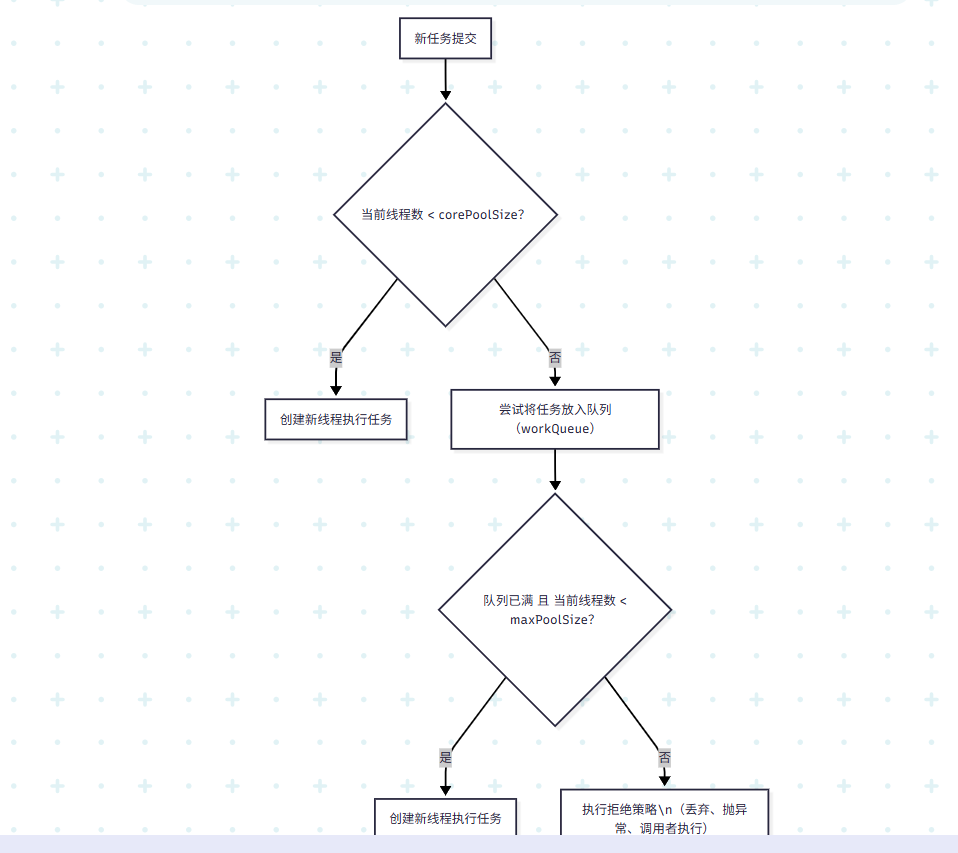

## 重要参数  
```java
public ThreadPoolExecutor(
    int corePoolSize,    // 核心线程数，保持存活
    int maximumPoolSize, // 最大线程数，线程池最大承载线程数
    long keepAliveTime,  // 非核心线程空闲存活时间
    TimeUnit unit,       // keepAliveTime 时间单位
    BlockingQueue<Runnable> workQueue,  // 任务队列，缓存等待执行任务  
    ThreadFactory threadFactory,        // 线程工厂，创建线程用
    RejectedExecutionHandler handler    // 拒绝策略，任务满时怎么处理
);

```

---
- corePoolSize：线程池维护的最小线程数。
- maximumPoolSize：线程池允许的最大线程数。
- keepAliveTime：超过 corePoolSize 的线程空闲后最大存活时间。
- workQueue：等待执行的任务队列。  调用的是堵塞队列的take方法 ，一直拉取，为空的话就堵塞拉取
- 拒绝策略：当线程池满了，还要提交任务时的处理方式。  
---  
## 执行流程


线程池工作流程
1. 新任务提交到线程池
2. 如果当前线程数少于 corePoolSize，创建新线程执行任务
3. 超过 corePoolSize，任务加入 workQueue 排队等待
4. 如果队列满且线程数小于 maximumPoolSize，创建新线程执行任务
5. 队列满且线程数达到 maximumPoolSize，执行拒绝策略

## 线程池常用拒绝策略  使用的offer放进来，只请求一次，无堵塞
AbortPolicy（默认）: 直接抛异常，拒绝任务
CallerRunsPolicy: 让提交任务的线程自己执行任务，降低任务提交速度
DiscardPolicy: 直接丢弃任务，不抛异常
DiscardOldestPolicy: 丢弃队列中最旧的任务，尝试给新任务腾位置

```java
public void execute(Runnable command) {
    if (当前运行线程数 < corePoolSize) {
        尝试创建新线程来执行任务
    } else if (workQueue.offer(command)) {
        // 尝试将任务放入队列（队列的 offer 方法）
    } else if (当前线程数 < maximumPoolSize) {
        再次尝试创建新线程
    } else {
        // 无法放入队列，无法创建新线程 -> 启动拒绝策略
        handler.rejectedExecution(command, this);
    }
}

```

## Java Executors 工具类常用线程池
Executors.newFixedThreadPool(int n)：固定大小线程池  
Executors.newCachedThreadPool()：缓存线程池，线程数不定，空闲60秒自动回收  
Executors.newSingleThreadExecutor()：单线程池，顺序执行任务  
Executors.newScheduledThreadPool(int n)：定时任务线程池  

## 使用commit和execute提交线程的方法
| 方法                  | 来自接口              | 返回值         | 能否获取执行结果 | 是否能处理异常     |
| ------------------- | ----------------- | ----------- | -------- | ----------- |
| `submit(Runnable)`  | `ExecutorService` | `Future<?>` | ✅ 可以获取结果 | ✅ 可以捕获异常    |
| `execute(Runnable)` | `Executor`        | `void`      | ❌ 不行     | ❌ 异常由线程自己处理 |
