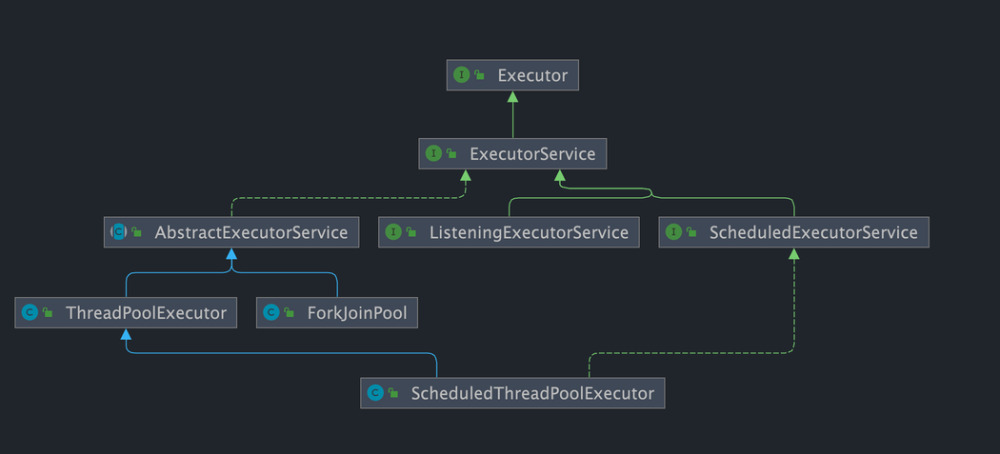

  
## executor 接口源码
只有一个方法
```java
public interface Executor {

    /**
     * Executes the given command at some time in the future.  The command
     * may execute in a new thread, in a pooled thread, or in the calling
     * thread, at the discretion of the {@code Executor} implementation.
     *
     * @param command the runnable task
     * @throws RejectedExecutionException if this task cannot be
     * accepted for execution
     * @throws NullPointerException if command is null
     */
    void execute(Runnable command);
}
```  
## ExecutorService 是 Executor 的子接口，提供了更丰富的功能，比如任务提交后可以返回结果、任务取消、线程池生命周期管理等。
| 方法签名                                                                                    | 说明                                             |
| --------------------------------------------------------------------------------------- | ---------------------------------------------- |
| `void shutdown()`                                                                       | **平滑关闭**，不再接收新任务，等待已提交任务完成                     |
| `List<Runnable> shutdownNow()`                                                          | **立即关闭**，尝试停止所有任务，返回尚未执行的任务列表                  |
| `boolean isShutdown()`                                                                  | 判断线程池是否已关闭（调用过 `shutdown()` 或 `shutdownNow()`） |
| `boolean isTerminated()`                                                                | 判断所有任务是否已结束，线程池是否完全关闭                          |
| `boolean awaitTermination(long timeout, TimeUnit unit)`                                 | 阻塞等待线程池关闭，最多等待指定时间                             |
| `<T> Future<T> submit(Callable<T> task)`                                                | 提交有返回值任务，返回 Future 可拿结果                        |
| `<T> Future<T> submit(Runnable task, T result)`                                         | 提交无返回值任务，返回 Future，可在 Future.get() 得到指定结果      |
| `Future<?> submit(Runnable task)`                                                       | 提交无返回值任务，返回 Future                             |
| `<T> List<Future<T>> invokeAll(Collection<? extends Callable<T>> tasks)`                | 批量提交任务，阻塞等待全部完成，返回 Future 列表                   |
| `<T> T invokeAny(Collection<? extends Callable<T>> tasks)`                              | 批量提交任务，只等待任一任务完成并返回结果                          |
| `<T> T invokeAny(Collection<? extends Callable<T>> tasks, long timeout, TimeUnit unit)` | 限时等待任一任务完成                                     |
