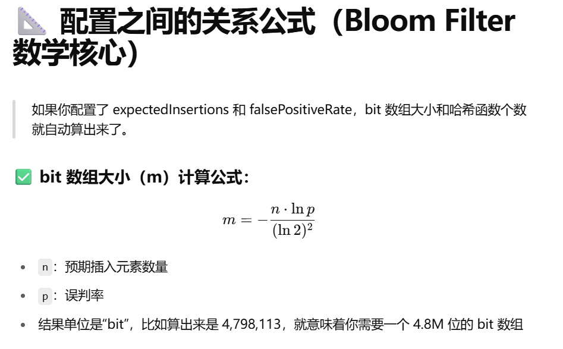

## 布隆过滤器 
### 什么是布隆过滤器（Bloom Filter）？ 一种概率型数据结构，用来判断一个元素是否存在于集合中。
- 优点：非常节省空间和查询时间。
- 缺点：可能出现误判（说存在但其实不存在），但不会漏判（存在一定查得到）。
## RBloomFilter 在 Redisson 中的特点 
1. 是 Redis 上的布隆过滤器实现。
2. 存储在 Redis 里，支持分布式、跨进程使用。
3. 线程安全，性能高。
4. 能设置误判率和容量大小。  
## RBloomFilter 的核心原理
内部用多个哈希函数把元素映射到一个位数组中，设置对应的位为 1。 查询时用同样的哈希函数检查对应的位是否全为 1。
任何一个位为 0，则元素一定不存在。 位全为 1，则元素可能存在（存在误判）。 
### Redisson RBloomFilter 主要方法
| 方法                                                          | 作用             | 说明              |
| ----------------------------------------------------------- | -------------- | --------------- |
| `tryInit(long expectedInsertions, double falseProbability)` | 初始化布隆过滤器容量和误判率 | 一定要先调用，配置误判率和容量 |
| `add(E element)`                                            | 添加元素           | 将元素哈希并设置对应位     |
| `contains(E element)`                                       | 判断元素是否存在       | 根据位状态判断是否可能存在   |
| `delete()`                                                  | 删除过滤器          | 删除 Redis 上的对应数据 |    
### 布隆过滤器的常用配置项（无论是 Java、Redisson 还是其他实现）

| 配置项                          | 含义         | 说明                                           |
| ---------------------------- | ---------- | -------------------------------------------- |
| **expectedInsertions**       | 预期插入元素个数   | 你预计将会插入多少个数据                                 |
| **falsePositiveRate**        | 误判率        | 比如 0.01 表示 1% 的误判率                           |
| **bitArraySize (m)**         | bit 位数组的大小 | 内部通过公式计算得出                                   |
| **hashFunctionsCount (k)**   | 哈希函数个数     | 也是根据公式推算出来的                                  |
| **autoScaling（Redisson 扩展）** | 自动扩容       | 某些高级实现支持自动扩容（如 Redisson ScalableBloomFilter） |
| **TTL（Redis 版本才有）**          | 设置有效期      | 可设置布隆过滤器的 Redis key 过期时间                     |

