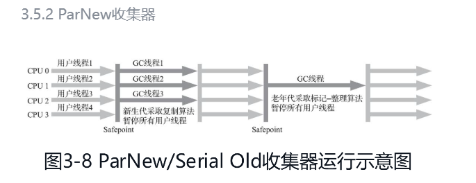
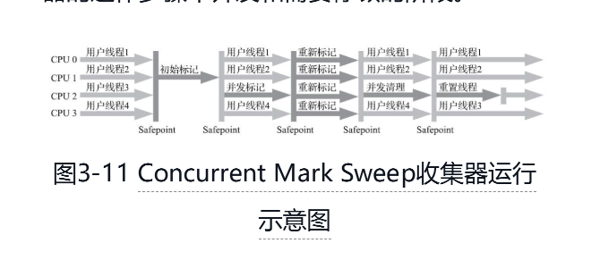
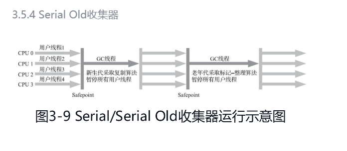
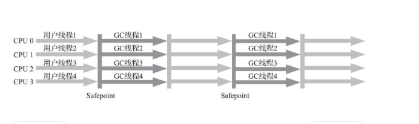

# 一些垃圾收集器 ，垃圾回收也可以叫做内存回收，属于java自动内存管理的一部分，自动内存管理还有内存分配
## 垃圾收集器中的并行和并发  
### 并行(Parallel)
- 并行描述的是多条垃圾收集器线程之间的关系，说明同一时间有多条这样的线程在协同工作，通常默认此时用户线程是处于等待状态
### 并发
- 并发(Concurrent)：并发描述的是垃圾收集器线程与用户线程之间的关系，说明同一时间垃圾收集器线程与用户线程都在运行。
由于用户线程并未被冻结，所以程序仍然能响应服务请求，但由于垃圾收集器线程占用了一部分系统资源，此时应用程序的处理的吞吐量将受到一定影响。
## serial 收集器 只用于新生代收集，标记复制算法，收集的时候时候发生STW(停止所有用户线程) ! serial Old 是收集老年代的
[img_3.png](img_3.png)  
- 大家只看名字就能够猜到，这个收集器是一个单线程工作的收集器，但它的“单线程”的意义并不仅仅是说明它只会使用一个处理器或一条收集线程去完成垃圾收集工作，
更重要的是强调在它进行垃圾收集时 必须暂停其他所有工作线程，直到它收集结束 Stop The World  
- 对于内存资源受限的环境，它是所有收集器里额外内存消耗(Memory Footprint)[插图]最小的；对于单核处理器或处理器核心数较少的环境来说，
Serial收集器由于没有线程交互的开销，专心做垃圾收集自然可以获得最高的单线程收集效率  
## ParNew收集器 跟serial差不多，就是比serial快一点点，也是新生代的  STW  
- ParNew收集器实质上是Serial收集器的多线程*并行**版本
-   
## CMS 垃圾收集器，标记清除 老年代的  注意是并发不是并行 ,空间碎片多，但是不需要移动存活的
- 收集器是一种以获取最短回收停顿时间为目标的收集器。目前很大一部分的Java应用集中在互联网网站或者基于浏览器的B/S系统的服务端上，这类应用通常都会较为关注服务的响应速度，
希望系统停顿时间尽可能短，以给用户带来良好的交互体验。CMS收集器就非常符合这类应用的需求。
- 这款收集器是HotSpot虚拟机中第一款真正意义上支持**并发**的垃圾收集器，它首次实现了让垃圾收集线程与用户线程（基本上）同时工作。 
- 执行过程 
  1. 初始标记: STW 初始标记仅仅只是标记一下GC Roots能直接关联到的对象，速度很快
  2. 并发标记 :就是从GC Roots的直接关联对象开始遍历整个对象图的过程，这个过程耗时较长但是不需要停顿用户线程，可以与垃圾收集线程一起并发运行；
  3. 重新标记 :STW 为了修正并发标记期 ，因用户程序继续运作而导致标记产生变动的那一部分对象的标记记录,这个阶段的停顿时间通常会比初始标记阶段稍长一些，但也远比并发标记阶段的时间短
  4. 并发清除 : ，清理删除掉标记阶段判断的已经死亡的对象，由于不需要移动存活对象，所以这个阶段也是可以与用户线程同时并发的

## Parallel Scavenge收集器 ,新生代的 记忆标志-复制算法，并行收集 STW，跟ParNew很像，但是他有特点  器也经常被称作“吞吐量优先收集器
- Parallel Scavenge收集器的特点是它的关注点与其他收集器不同，CMS等收集器的关注点是尽可能地缩短垃圾收集时用户线程的停顿时间
，而Parallel Scavenge收集器的目标则是达到一个可控制的吞吐量(Throughput)  ,使用参数设置
- 什么是吞吐量呢?
  - 理器用于运行用户代码的时间与处理器总消耗时间  的比值，即： 如果虚拟机完成某个任务，用户代码加上垃圾收集总共耗费了100分钟，其中垃圾收集花掉1分钟，那吞吐量就是99%。
  -   
- 怎么理解这个收集器呢，假如设置的吞吐量越小，那么你垃圾回收的次数就多，如果你吞吐量设置的小，那么回收次数少  
- 垃圾收集停顿时间缩短是以牺牲吞吐量和新生代空间为代价换取的：系统把新生代调得小一些，收集300MB新生代肯定比收集500MB快，但这也直接导致垃圾收集发生得更频繁
，原来10秒收集一次、每次停顿100毫秒，现在变成5秒收集一次、每次停顿70毫秒。停顿时间的确在下降，但吞吐量也降下来了。  
## Serial Old收集器，使用在老年代，标记整理算法 ，单线程
  
## Parallel Old收集器，老年代，多线程并发，标记整理  
- 直到Parallel Old收集器出现后，​“吞吐量优先”收集器终于有了比较名副其实的搭配组合，在注重吞吐量或者处理器资源较为稀缺的场合，
都可以优先考虑Parallel Scavenge加Parallel Old收集器这个组合。Parallel Old收集器的工作过程如图3-10
- 
