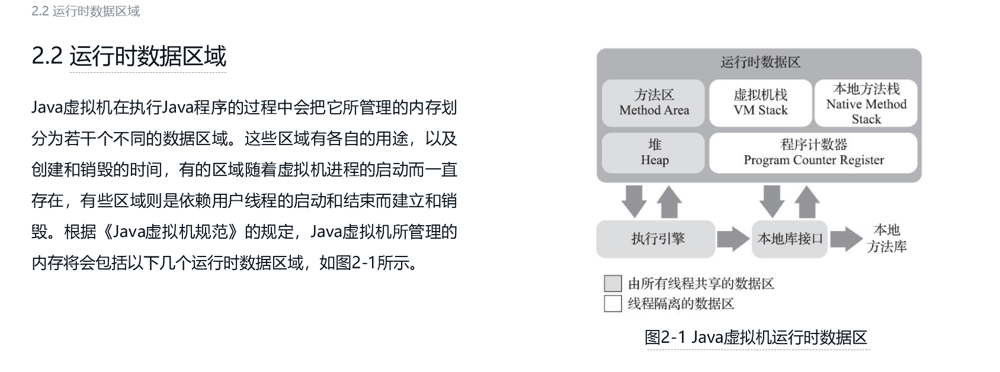

## jvm虚拟机所管理的内存包括以下几个运行时数据区  
- 下图是他规范，这个规范比较稳定，一般来说他的每一个实现可能有点区别
  
### 程序计数器 这个区域JVM没有规定任何OutOfMemoryError，各线程都有一个，线程私有
### java虚拟机栈  
- 线程销毁的时候数据也丢失，不需要GC
- 线程私有的，每一个线程都有一个，生命周期和线程私有
- 异常  
  - 如果线程深度超过虚拟机允许的的深度，将抛出StackOverflowError异常
  - 如果java虚拟机栈容量可以动态扩展，当栈扩展时无法申请到足够的内存会抛出OutOfMemoryError
### 本地方法栈，线程私有，异常和java虚拟机栈一样，因为他也是对方法，只是native方法，这里也不需要GC
### 堆 ，存放几乎所有对象，这里会发生多种Error
### 方法区 这里会发生OutOfMemoryError
- 存放 已经被虚拟机加载类型信息，常量，静态变量，即时编译器后的代码缓存等，也叫做非堆
- 这个区域一般不进行垃圾收集行为，如果收集的话一般收集这两个，常量池回收或者类型的卸载 
- 这里面的运行时常量池，存放编译时期各种字面量和符号引用，当一个类被加载之后，他的所有字面量和符号会被引入进来
运行时常量池也不是一定是编译时期才能进来运行时常量池的，比如String的intern（）方法会动态放进来，注意这个区域也会会有  
单独的内存限制，如果无法申请到需要的内存的时候也会OOM；