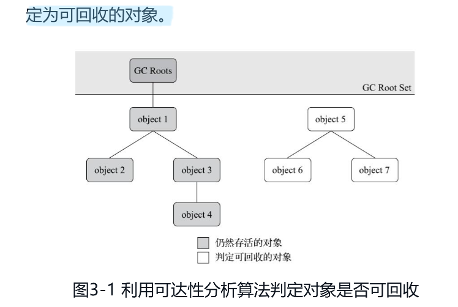

## 如果判断一个对象是不是死了可以回收了
### 引用计数法  引用计数式垃圾收集，每个对象留一点区域记录他被谁引用了或者引用的总数量记录下来
很多教科书判断对象是否存活的算法是这样的：在对象中添加一个引用计数器，每当有一个地方引用它时，计数器值就加一；当引用失效时，计数器值就减一；
任何时刻计数器为零的对象就是不可能再被使用的。客观地说， 引用计数算法(Reference Counting)虽然占用了一些额外的内存空间来进行计数，但它的原理简单，判定效率也很高，在大多数情况下它都是一个不错的算法。也有一些比较著名的应用案例，  
- Java领域，至少主流的Java虚拟机里面都没有选用引用计数算法来管理内存，
- 主要原因是，这个看似简单的算法有很多例外情况要考虑，必须要配合大量额外处理才能保证正确地工作，譬如单纯的引用计数就很难解决对象之间相互循环引用的问题  
```java
package print;

/**
 * 演示引用计数法的弊端
 */
public class ReferenceCountingGc {
    public Object instance = null;

    private static final int _1MB = 1024 * 1024;

    private byte[] bigSize = new byte[_1MB*2];

    public static void main(String[] args) throws Exception {
        // 下面会出现循环引用
        ReferenceCountingGc gc = new ReferenceCountingGc();
        ReferenceCountingGc gc1 = new ReferenceCountingGc();
        gc.instance = gc1;
        gc1.instance = gc;

        //下面赋值为null 然后开始测试GC
        gc = null; gc1 = null;

        System.gc();
    }
    /**
     * [0.009s][info][gc] Using G1
     [0.077s][info][gc] GC(0) Pause Full (System.gc()) 11M->0M(14M) 2.854ms 看这里从11回收后变为0 说明上面 循环引用的对象被垃圾收集了，说明了现在的
     方法使用的并不是引用计数法，如果使用的引用计数法，就算 gc.instance = gc1;gc1.instance = gc; 上面的循环引用不会被回收
     */
}

```
### 可达性算法 追踪式垃圾收集 对象最为节点，引用作为边，利用类似于离散数学的可达性算法
。这个算法的基本思路就是通过一系列称为“GC Roots”的根对象作为起始节点集，从这些节点开始，根据引用关系向下搜索，搜索过程所走过的路径称为“引用链”(Reference Chain)，
如果某个对象到GC Roots间没有任何引用链相连，或者用图论的话来说就是从GC Roots到这个对象不可达时，则证明此对象是不可能再被使用的。  
  
- 在Java技术体系里面，固定可作为GC Roots的对象包括以下几种：
  - 在虚拟机栈（栈帧中的本地变量表）中引用的对象，譬如各个线程被调用的方法堆栈中使用到的参数、局部变量、临时变量等。
  - ·在方法区中类静态属性引用的对象，譬如Java类的引用类型静态变量。
  - ·在方法区中常量引用的对象，譬如字符串常量池(StringTable)里的引用。
  - ·在本地方法栈中JNI（即通常所说的Native方法）引用的对象。
  - ·Java虚拟机内部的引用，如基本数据类型对应的Class对象，一些常驻的异常对象（比如NullPointExcepiton、OutOfMemoryError）等，还有系统类加载器。
  - ·所有被同步锁（synchronized关键字）持有的对象。
  - ·反映Java虚拟机内部情况的JMXBean、JVMTI中注册的回调、本地代码缓存等。 
- 除了这些固定的GC Roots集合以外，根据用户所选用的垃圾收集器以及当前回收的内存区域不同，还可以有其他对象“临时性”地加入，共同构成完整GC Roots集合。
譬如后文将会提到的分代收集和局部回收(Partial GC)， 如果只针对Java堆中某一块区域发起垃圾收集时（如最典型的只针对新生代的垃圾收集）​，必须考虑到内存区域是虚拟机自己的实现细节
在用户视角里任何内存区域都是不可见的）​，更不是孤立封闭的，所以某个区域里的对象完全有可能被位于堆中其他区域的对象所引用，这时候就需要将这些关联区域的,对象也一并加入GC Roots集合中去，才能保证可达性分析的正确性  
- 目前最新的几款垃圾收集器[插图]无一例外都具备了局部回收的特征，为了避免GC Roots包含过多对象而过度膨胀，它们在实现上也做出了各种优化处理  
#### GC ROOTS 选举 集合 ，找出可以作为ROOT的集合，就是跟节点的选择 还需要了解HotSpot的OopMap的在根节点作用
- 所有JVM的当进行GC ROOTS 选举的时候 所有收集器在根节点枚举这一步骤时都是必须暂停用户线程的，因此毫无疑问根节点枚举与之前提及的整理内存碎片一样会面临相似的“Stop The World”的困扰。
但根节点枚举始终还是必须在一个能保障一致性的快照中才得以进行——这里“一致性”的意思是整个枚举期间执行子系统看起来就像被冻结在某个时间点上，不会出现分析过程中，根节点集合的对象引用关系还在不断变化的情况，
若这点不能满足的话，分析结果准确性也就无法保证。这是导致垃圾收集过程必须停顿所有用户线程的其中一个重要原因，即使是号称停顿时间可控，或者（几乎）不会发生停顿的CMS、G1、ZGC等收集器，枚举根节点时也是必须要停顿的。
- 但是当你选出根节点集合的以后，**在可达性分析算法耗时最长的查找引用链的过程已经可以做到与用户线程一起并发**
#### 根节点选举完了之后，就需要处理引用关系了，但是你处理完了根节点之后程序一致运行，引用边怎么处理，程序运行的话引用边就会一直变化，这时候让全部线程停下来再处理边据可以了
- 运行运行到哪里停下来呢？任何地方都可以停下来吗？一般有下面几个地方让程序停下来最好，一次GC有很多线程，每个线程在一次GC中可以在自己的区域里面选择一个下面的地方停下来
  - 是否具有让程序长时间执行的特征”为标准进行选定的，因为每条指令执行的时间都非常短暂，程序不太可能因为指令流长度太长这样的原因而长时间执行
  “长时间执行”的最明显特征就是 指令序列的复用，例如方法调用、循环跳转、异常跳转等都属于指令序列复用，所以只有具有这些功能的指令才会产生安全点。
  -但是安全点实在太细了，让所有线程都停止在这么小的地方不合适，所有有了 **安全区域**
  - 安全区域
    - 安全区域是指能够确保在某一段代码片段之中，引用关系不会发生变化，因此，在这个区域中任意地方开始垃圾收集都是安全的。我们也可以把安全区域看作被扩展拉伸了的安全
    - 当用户线程执行到安全区域里面的代码时，首先会标识自己已经进入了安全区域，那样当这段时间里虚拟机要发起垃圾收集时就不必去管这些已声明自己在安全区域内的线程了。当线程要离开安全区域时， 
它要检查虚拟机是否已经完成了根节点枚举（或者垃圾收集过程中其他需要暂停用户线程的阶段，如果完成了，那线程就当作没事发生过，继续执行；否则它就必须一直等待，直到收到可以离开安全区域的信号为止。
- 当需要GC的时候，并且线程进入了安全区域，如何让线程停下来呢，直接强制他停止吗？ 
  - 抢占式中断，就是JVM强制让线程中断，
  - 主动式中断 而主动式中断的思想是当垃圾收集需要中断线程的时候，不直接对线程操作，仅仅简单地设置一个标志位，各个线程执行过程时会不停地主动去轮询这个标志，一旦发现中断标志为真时就自己在最近的安全点上主动中断挂起。
轮询标志的地方和安全点是重合的，另外还要加上所有创建对象和其他需要在Java堆上分配内存的地方，这是为了检查是否即将要发生垃圾收集，避免没有足够内存分配新对象
  - 对上述的一些总结，就是JVM在代码编译或者运行阶段就会对线程的安全区域做一些标记，线程运行的时候会检查这些标记，自己是否已经进入安全区域并且GC收集信号已经发出来了，如果是我就应该主动挂起了
#### 追踪式垃圾收集需要处理的另外一个问题的，现在都是分代收集的，比如老年代，新生代，当我只收集新生代的时候，万一老年代中有新生代的引用呢？
- 那么是不是也需要扫描整个老年代，一个一个去扫描呢，有没有更好的办法，这个办法就是记忆集(抽象) ，卡表（记忆集的实现） ,可以缩短GC Root扫描范围
- 基于上面的案例说明记忆集和卡表，我们可以把老年代分为不同的区域，每个区域记录了他是否有新生代的引用，当我们扫描老年代的时候，先看卡表，这个老年代区域有没有新生代的引用，这个时候效率就提高了  
可以只要扫描有新生代引用的区域，哪些没有新生代的引用的区域就不需要扫描
```text
| 老年代（Old）                         |
|---------------------------------------|
| Card 0 | Card 1 | Card 2 | Card 3 ...|
    ↑               ↑
    |               |
  有引用         有引用   → 记忆集记录 Card 0 和 Card 2
当进行新生代 GC 时，只去扫记忆集记录的这些 Card 区域，不用扫整个老年代。
```
### 再谈这个引用  
在JDK 1.2版之后，Java对引用的概念进行了扩充，将引用分为强引用(Strongly Re-ference)、软引用(SoftReference)、弱引用(Weak Reference)和虚引用(PhantomReference)4种，这4种引用强度依次逐渐减弱。
·强引用是最传统的“引用”的定义，是指在程序代码之中普遍存在的引用赋值，即类似“Object obj=new Object()”这种引用关系。无论任何情况下，只要强引用关系还存在，垃圾收集器就永远不会回收掉被引用的对象。
·软引用是用来描述一些还有用，但非必须的对象。只被软引用关联着的对象，在系统将要发生内存溢出异常前，会把这些对象列进回收范围之中进行第二次回收，如果这次回收还  没有足够的内存，才会抛出内存溢出异常。在JDK 1.2版之后提供了SoftReference类来实现软引用。
```java
import java.lang.ref.SoftReference;
SoftReference<Object> softRef = new SoftReference<>(new Object()); // 软引用
```
·弱引用也是用来描述那些非必须对象，但是它的强度比软引用更弱一些，被弱引用关联的对象只能生存到下一次垃圾收集发生为止。当垃圾收集器开始工作，无论当前内存是否足够，
都会回收掉只被弱引用关联的对象。在JDK 1.2版之后提供了WeakReference类来实现弱引用。
·虚引用也称为“幽灵引用”或者“幻影引用”​，它是最弱的一种引用关系。一个对象是否有虚引用的存在，完全不会对其生存时间构成影响，也无法通过虚引用来取得一个对象实例。
为一个对象设置虚引用关联的唯一目的只是为了能在这个对象被收集器回收时收到一个系统通知。在JDK 1.2版之后提供了PhantomReference类来实现虚引用 
### jdk引用类
| 类名                    | 说明            |
| --------------------- | ------------- |
| `Reference<T>`        | 所有引用类的父类      |
| `SoftReference<T>`    | 软引用类          |
| `WeakReference<T>`    | 弱引用类          |
| `PhantomReference<T>` | 虚引用（幽灵引用）类    |
| `ReferenceQueue<T>`   | 引用队列（配合上面三个用） |  
### 到底是生存还是死亡呢 finalize 自救 finalize()方法是对象逃脱死亡命运的最后一次机会，只能自救一次，官方也不推荐使用这个方法了，
- 即使在可达性分析算法中判定为不可达的对象，也不是“非死不可”的，这时候它们暂时还处于“缓刑”阶段，要真正宣告一个对象死亡，至少要经历两次标记过程：
- 如果对象在进行可达性分析后发现没有与GC Roots相连接的引用链，那它将会被**第一次**标记，**随后进行一次筛选**，，这个筛选就是到底要不要执行你的finalise方法
- 筛选的条件是此对象是否有必要执行finalize()方法。
  - 假如对象没有覆盖finalize()方法，或者finalize()方法已经被虚拟机调用过，那么虚拟机将这两种情况都视为“没有必要执行”​。
  
  - 如果这个对象被判定为确有必要执行finalize()方法，那么该对象将会被放置在一个名为F-Queue的队列之中，并在稍后由一条由虚拟机自动建立的、低调度优先级的Finalizer线程
去执行它们的finalize()方法。这里所说的“执行”是指虚拟机会触发这个方法开始运行，但并不承诺一定会等待它运行结束。这样做的原因是，如果某个对象的finalize()方法执行缓慢，
或者更极端地发生了死循环，将很可能导致F-Queue队列中的其他对象永久处于等待，甚至导致整个内存回收子系统的崩溃。finalize()方法是对象逃脱死亡命运的最后一次机会，
稍后收集器将对F-Queue中的对象进行第二次小规模的标记，如果对象要在finalize()中成功拯救自己——只要重新与引用链上的任何一个对象建立关联即可，譬如把自己（this关键字）
赋值给某个类变量或者对象的成员变量，那在第二次标记时它将被移出“即将回收”的集合；如果对象这时候还没有逃脱，那基本上它就真的要被回收了。  
## 处理完一个对象式生存还是死亡之后，就要研究垃圾收集算法  


